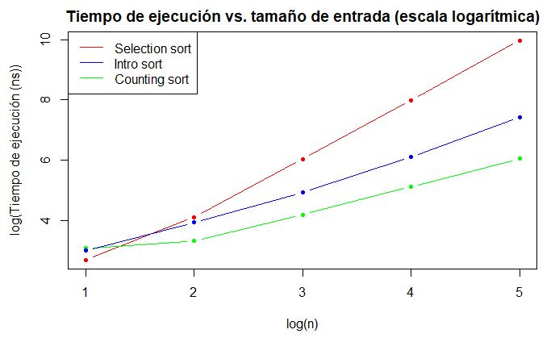

# 
 Counting Sort 

### Algortimo y Estructura de Datos - 2022 - 2

|            Participante             |  Código  |
|:-----------------------------------:|:--------:|
|  Joaquín Francisco Jordán O'Connor  | 202110176  |
|    Renato Aurelio Cernades Ames     | 202110068  |
|    José Rafael Chachi Rodriguez     | 202110069 |

## Descripción del proyecto
El presente proyecto busca aplicar el método de ordenamiento __*counting sort*__ mediante un pseudocódigo brindando por [1]. Posteriormente se analizará la complejidad computacional utilizando 10, 100, 1000, 10000, 100000 y 1000000 datos. Por último, se comparará el método implementado con otro método de ordenamiento conocido como __*selection sort.*__
### Limitaciones:
- Hay que tener en cuenta que el algoritmo funciona exclusivamente con enteros positivos dentro de un rango finito.
- Se asume que el contenedor a ordenar tiene **al menos** un elemento.
- El método implementado no utiliza un ordenamiento comparativo. 
### Complejidad algorítmica:
_Counting sort_ tiene una complejidad de theta grande de n Θ(n). 
#### Grafíco

## Guía de uso
Primero se debe ejecutar el archivo generate.cpp. Esto nos generará archivos con los que vamos a trabajar, estos están diferenciados por la cantidad de elementos. Posteriormente se procederá a ejecutar el archivo del método de ordenamiento que se desea aplicar. Cabe recordar que los contenedores a ordenar son los generados por las listas. 
## Bibliografía
- [1] T. Cormen, C. Leiserson, R. Rivest, C. Stein, "Introduction to Algorithms Third Edition", 2009. [Online]. Available: https://sd.blackball.lv/library/Introduction_to_Algorithms_Third_Edition_(2009).pdf .[Accessed: Aug 15, 2022] 